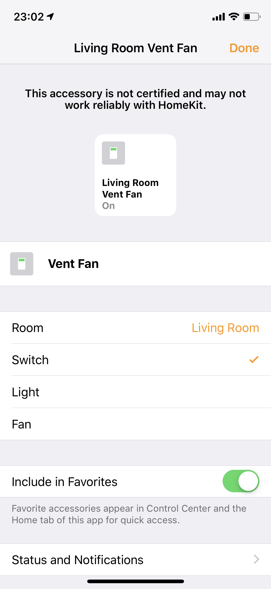

# homebridge-switchbot

A [Homebridge](https://github.com/nfarina/homebridge) plugin for [SwitchBot](https://www.switch-bot.com).

## Requirements

* Currently only Linux is supported
* `gatttool` needs to be installed

## Installation

Install the npm package:

```bash
sudo npm install -g homebridge-switchbot
```

Find your SwitchBot's MAC address (BLE MAC) with the official iOS/Android app, and add an accessory definition to `~/.homebridge/config.json`:

```json
{
    "accessories": [
        {
            "accessory": "SwitchBot",
            "name": "Wall Switch",
            "macAddress": "01:23:45:67:89:AB"
        }
    ]
}
```

Currently only SwitchBot's [light switch mode](https://www.youtube.com/watch?v=Jy_0bfCF8_M) (stateful switch with push/pull) is supported.

You can change the accessory type to light or fan in the Home app:


